# Faster RCNN for Object Detection on Satellite Images

# Pre-requistes
 - Colab
 - Keras
 - Tensorflow
 - Pandas
 
# Preprocessing
In first step, separate images into train,valid and test directories. The dataset was provided in <b>Pascal voc </b> but was converted to custom format
of `filepath,x1,y1,x2,y2,class_name`. Training requires annotation files in `.txt` format. For step by step preprocessing please refer to 
`Preprocessing/FRCNN_preprocessing.ipynb`  

Example dataset provided in `Dataset` folder

# Network Summary
## Faster RCNN
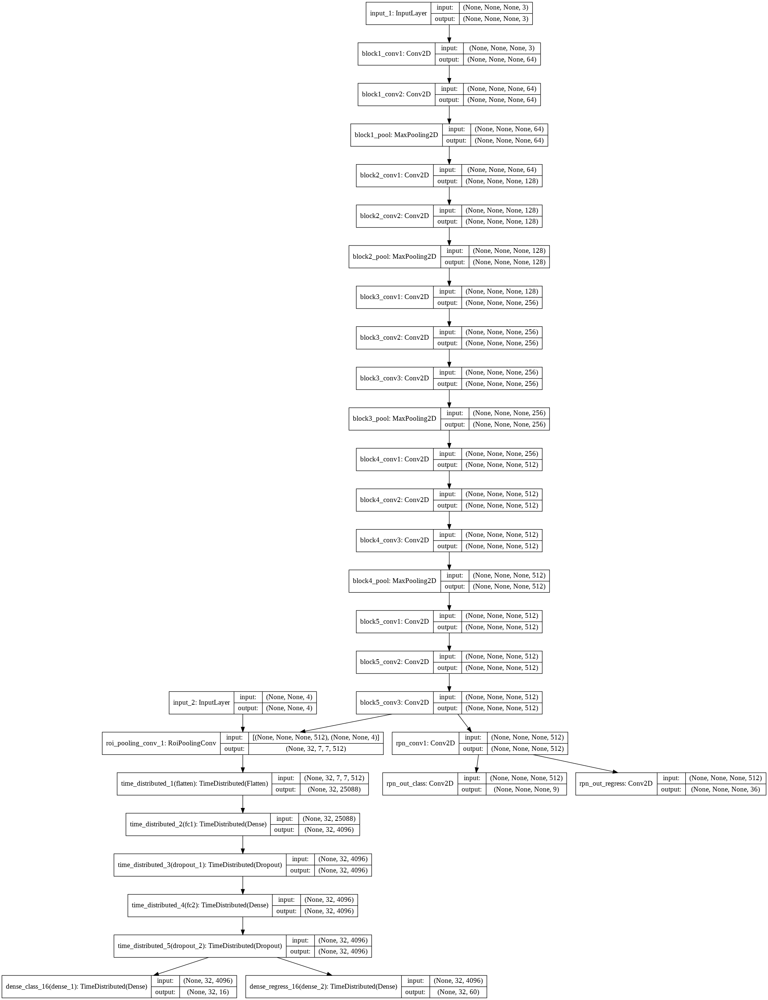

# Training
Refer to `frcnn_train_vgg.ipynb`

# Testing
Refer to `frcnn_test_vgg.ipynb`.  
Note: training config is used for test the Model.

# Performance Measures
Model | Validation mAP | Test mAP
------------ | ------------- | -------------
Faster-RCNN | 0.515 | 0.508

# Performance Graphs
## Training settings
Pretrained weights can be from `keras/application`

Image Size = 512

Number of RoIs at once = 4

Data Augumentation: Horizontal flips, Vertical Flips, rotation 90 degree.

RPN optimizer - Adam - Learning rate =1e-5
Classification optimizer - Adam - Learning rate =1e-5
Overall optimizer - SGD - Learning rate =1e-5

Loss function = Mean Absolute Error (MAE)

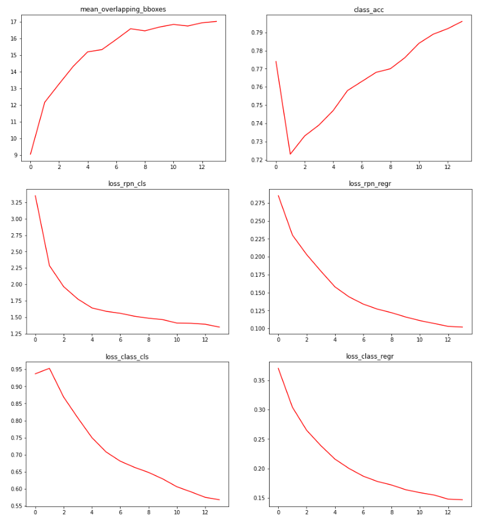
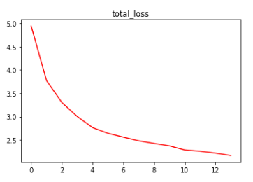
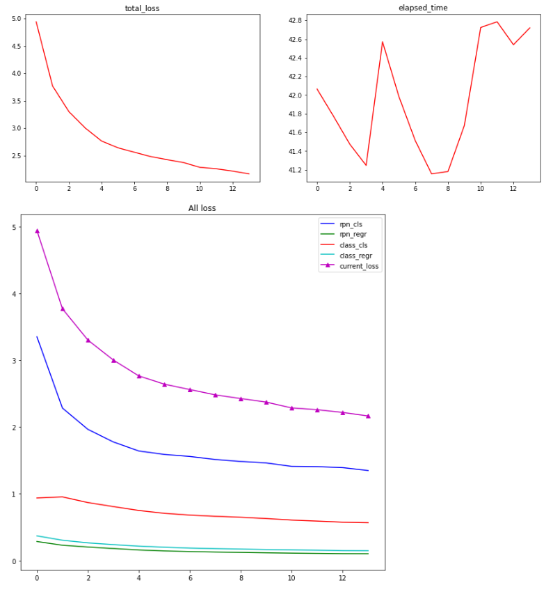

# Visual Results
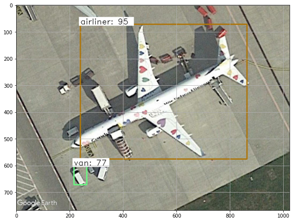
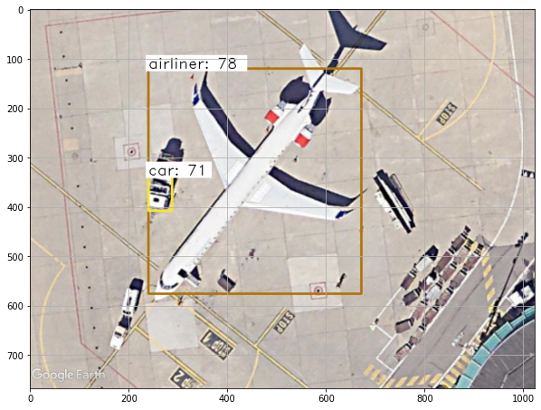
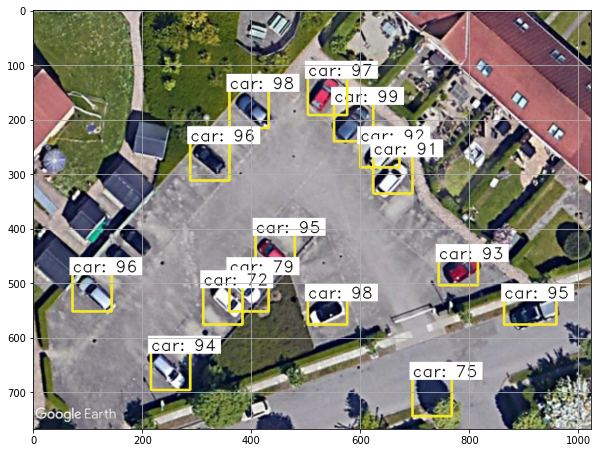
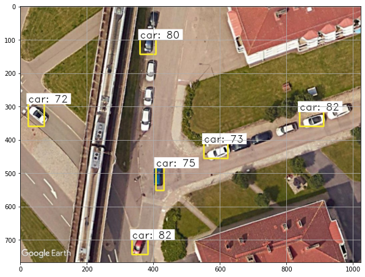
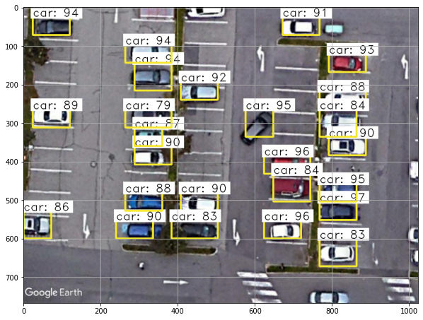
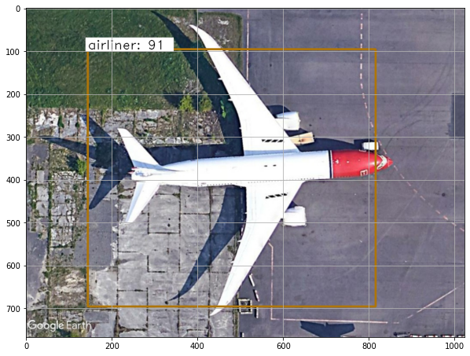
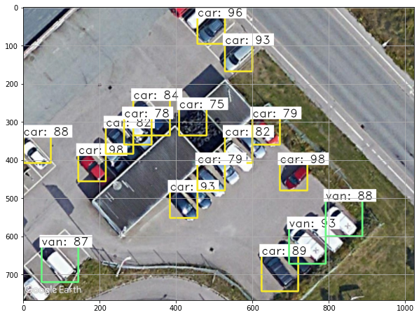
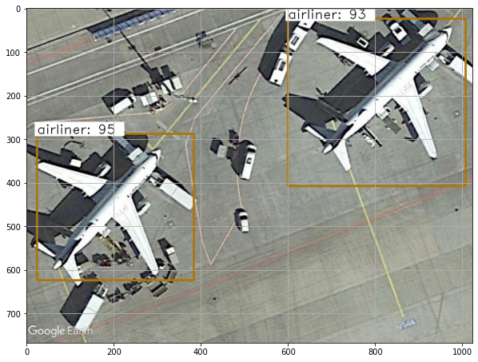
