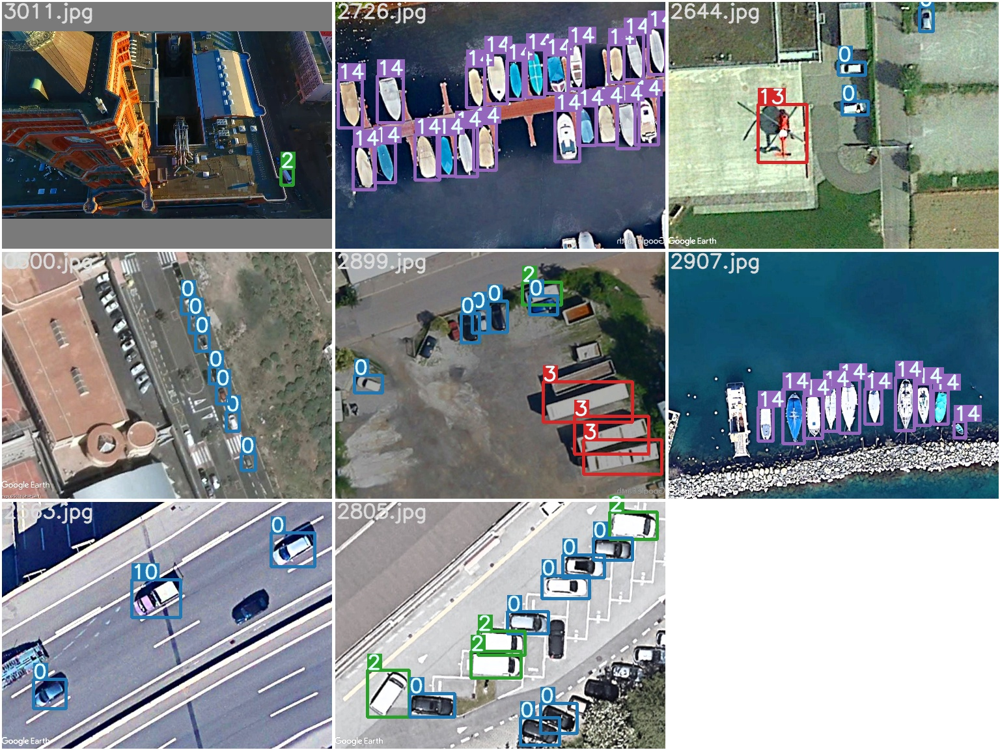
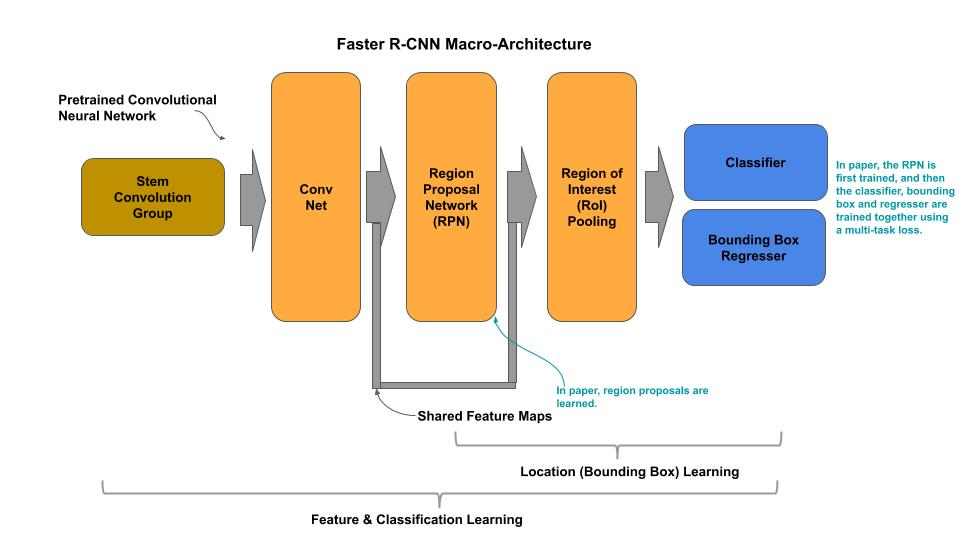
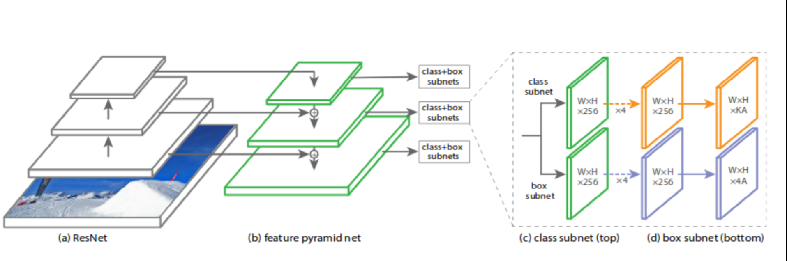
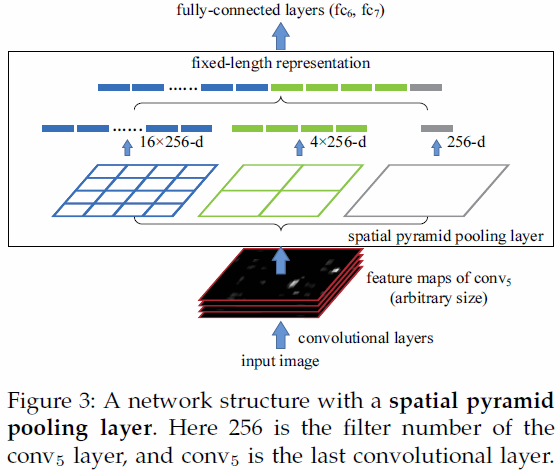

# Repository for Object Detection Satellite Imagery Multi-vehicles Dataset (SIMD)
 Repository contains RetinaNet,Yolov3 and Faster RCNN for multi object detection on satellite images dataset.
 
# Links availble here for Detailed Readme Files, Rest of the page has summary for all models:
Further Details can be found here in repsective Readme Files,
contains Preprocessing, performance graphs, visual results, network summaries etc.   
[RetinaNet](RetinaNet/)
 
[Yolov3](Yolov3/)
 
[Faster RCNN](Faster_RCNN/)
 

# Dataset
Satellite Imagery Multi-vehicles Dataset (SIMD). It comprises 5,000 images of resolution 1024
x 768 and collectively contains 45,303 objects in 15 different classes of vehicles including cars,
trucks, buses, long vehicles, various types of aircrafts and boats. The source images are taken
from public satellite imagery available in Google Earth and contain images of multiple
locations from seven countries.

## Few Dataset examples:

# Data Annotations
With each image, the annotation is available as text file. The annotation format can be
described as (c, xi, yi, w, h), where c is the object class starting from 0, (xi, yi) are the center
of object and (w, h) are width and height respectively. All these values are percentages to the
actual image.

# Models

This repository contains three different object detection model alongwith their improvements:
 - Yolov3
 - introduced SPP (Spatial Pyramid Pooling) module to Yolov3
 - RetinaNet
	- (1) supports ResNet50 backbone
	- (2) supports EfficientNetB7 backbone
 - Faster-RCNN
	- supports VGG16

# Diagrams

## [Faster-RCNN](https://arxiv.org/abs/1506.01497)

## [RetinaNet](https://arxiv.org/abs/1708.02002)

## [Yolov3](https://arxiv.org/abs/1804.02767)

## [Yolov3-SPP](https://arxiv.org/pdf/1907.11093)

# Performance Measures
Models | Validation mAP | Test mAP
------------ | ------------- | -------------
Yolov3 | 0.608 | 0.634
Yolov3-SPP | 0.653 | 0.679
RetinaNet (ResNet50) | 0.8442 | 0.6231
RetinaNet (EfficientNetB7) | 0.6126 | [evaluation script error-see this issue](https://github.com/fizyr/keras-retinanet/issues/647)
Faster-RCNN | 0.515 | 0.508

# Pre-Trained Models
Pre-trained models can be downloaded from `*/Model/link.txt` in respective folder.
	
# Mainted by:
Asim Hameed Khan  
Contact: https://www.linkedin.com/in/asimniazi63/

# Acknowledgements
https://github.com/RockyXu66/Faster_RCNN_for_Open_Images_Dataset_Keras/
 
https://github.com/ultralytics/yolov3
 
https://github.com/fizyr/keras-retinanet
 
